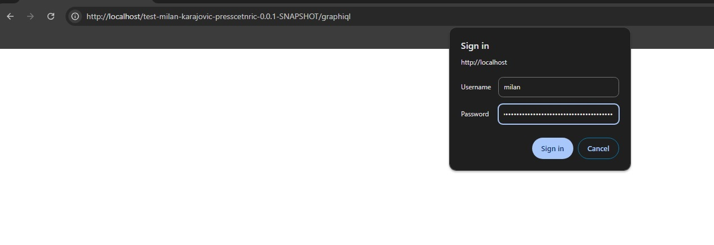
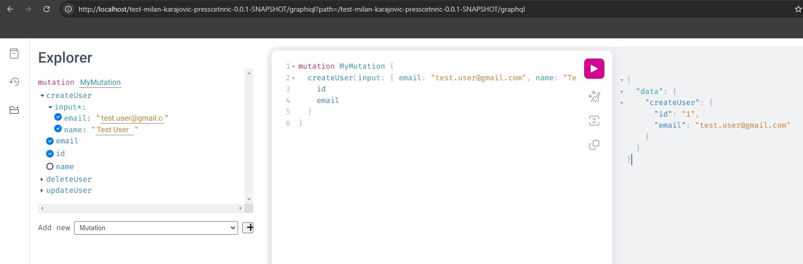

# DGS-GrqphQL-Gradle-War
Example DGS Framework for GraphQL using war file to deploy on the Tomcat server using Docker


## Author

- Milan Karajovic


## Tech Stack

**Server:** 
- Java 17, 
- Spring Boot 3.3.2, 
- Netflix DGS GraphQL 9.0.4
- JPA
- Gradle
- Lombok
- JUnit

**Database:**
- H2

**Start application:**
- Tomcat
- Docker

## Documentation

The application demonstrates how to create an effective application that implements GraphQL using the [Netflix DGS](https://netflix.github.io/dgs/) framework in the [Spring Boot](https://spring.io/projects/spring-boot) application .

### Application development and analysis
- Create spring Boot applciation using [Spring Initializr](https://start.spring.io/). Setup is shown on the picture below:

  

- The DGS framework is designed for schema first development. The framework picks up any schema files in the src/main/resources/schema folder. We created schema file schema.graphql. In this file are defined types, queries and mutations. Regarding this class we create classes in specific packages in the application.

- It is possible using DGS plugin to generated Java source code using previously defined GraphQL schemas. However, I prefer to use Lombok annotations, so I did that manually.

- This is application structure:

  

- The most important clases are:

    - Domain: (src\main\java\com\example\presscentric\test_milan_karajovic_presscetnric\domain) - Thera are defined domain object which exists in the above mentioned file schema\schema.graphql .

    - Repository: (src\main\java\com\example\presscentric\test_milan_karajovic_presscetnric\repository) - Thera are defined JPA repository which is used from the application to communicate with databse.

    - Service: (src\main\java\com\example\presscentric\test_milan_karajovic_presscetnric\service) - Service is layer which is between fatcher and repository.

    - Fetcher: (src\main\java\com\example\presscentric\test_milan_karajovic_presscetnric\fetcher) - This is central part of the DGS GraphQL application. There are defined Queries and Mutations regarding to the declaration in the schema.graphql file.
      - Netflix DGS provides annotation-based support for Spring Boot.
      - The UserFetcher is responsible for defining queries related to the User object. We should annotate such a class with @DgsComponent . Then, we have to annotate every query method with @DgsData . The fields parentType and fields should match the names declared in GraphQL schemas for Queries. We can see that in the file schema.graphql are defined two queries, so we have two methods inside UserFetcher. To fetch data from the database are used methodes from the Service class. The last query method findUserById performs advanced filtering based on the user id field passed in the input. To pass an input parameter we should annotate the method argument with @InputArgument.
      - In comparison to the UserFetcher, UserMutation implementation is similar. The fields parentType and fields should match the names declared in GraphQL schemas for Mutations. To pass an input parameter we should annotate the method argument with @InputArgument. To execute Muttaion methodes are used methodes from the Service class.
	  
- Database - For this demo application is used inmemory H2 database. Configuration for the database is in the application.properties file. data.sql script is used for initial filing database with data.
- Tests - Test are in the src/test/java/com/example/presscentric/test_milan_karajovic_presscetnric/fetcher . There are tests for the Queries and Mutations.


## Build, and run application using docker.

- Prerequest is to have installed Docker on your machine.
- Download source code for this exaple from the Github.
- Build the application using Gradle (For building I suggest to use STS or intelliJ IDEA development environment. However, you can do that also manually with gradle command).
```bash
  ./gradlew clean build
```
- The .war file is created in the folder build\libs: test-milan-karajovic-presscetnric-0.0.1-SNAPSHOT.war
- Using Docker file, we ceate image tomcat-test-milan-karajovic-presscetnric using next command in the console (It is necessary to open the console in the root folder of the project). The command is:
```bash
docker build -t tomcat-test-milan-karajovic-presscetnric .
```
- Now, we can start applciaton using docker-compose.yaml file.  (It is necessary to open the console in the root folder of the project). The command is:
```bash
docker-compose up
```
- After application is success started, let’s just use the GraphiQL tool to run test queries. It is automatically included in the application by the Netflix DGS library. We may display it by invoking the URL http://localhost/test-milan-karajovic-presscetnric-0.0.1-SNAPSHOT/graphiql (securyti is implemented). 
 - Username and password are in  the file src\main\resources\application.properties
  
 - GraphQL tool dashboard. There are all Queries and Mutations:
  
 - Show all users in database using Query:
  
 - Crete user using Mutation:
  
 - Show all users after creted new user in the previous step:
  
 - You can check all Queries and Mutation yourself using this dashboard.
 
## Support

- For additional clarification please do not hesitate to contact me.
- Together, we can improve and learn everything.
- Together we can change the world.